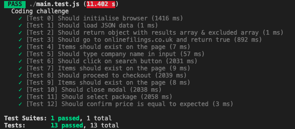

# Tech Test for Online Filings

My response to Online Filings tech test - an implementation of Puppeteer that can create an instanced browser. It can:

- Load a set of instructions from a JSON file.

- Parse the JSON files instructions into JavaScript, excluding any duplications.

- Goto a given web page in a tab, returning the URL or an empty string in case of an error.

- Check the existence of given selectors in the page's DOM, returning an array of objects that pair the selector with the boolean existence status.

- Enter text into a given element in the page's DOM.

- Click a given element on the page's DOM.

- Check equality between a given value and the value of a given selector within the DOM.

It is passing all of the 13 tests that were given.

# Usage

1. Ensure you have NodeJS installed (https://nodejs.org/en/download/).
2. $ git clone https://github.com/ehwus/online-filings-tech-test
3. $ cd ./online-filings-tech-test
4. $ npm install
5. $ npm test

## Brief

The goal of this exercise is to show your understanding of:

- basic coding principles

- json data structures

- javascript/nodeJS syntax

- using new API (puppeteer)

- reading technical documentation and find solutions on your own

You have 48 hours after receiving this test by email to send it back.

Please note that we will only be able to consider your submission if the code runs and is in a working state.

You are allowed (and encouraged) to search for documentation, tutorials, how-tos... online,

BUT **you have to do the exercise by yourself**.

You will be asked to explain your code during the following interview.
